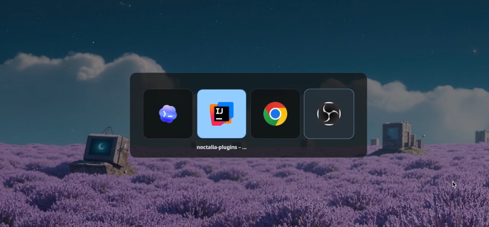

# whereareiam's Noctalia Plugins

Some collection of maybe useful plugins for Noctalia.

## Add This Repository As a Source

1. Open Noctalia.
2. Go to the plugins section.
3. Add a custom plugin source.
4. Use the repository URL of this source repo:

```text
https://github.com/whereareiam/noctalia-plugins
```

5. Install the plugin you want from the list.

## Plugins

<details>
<summary><strong>Veil</strong> — hidden window manager</summary>

### What it does

Veil hides focused windows and lets you restore them later.

It supports:
- hiding the currently focused visible window
- a bar icon that appears when hidden windows exist
- a restore menu for bringing hidden windows back
- integration points for other plugins such as Tabber

### Requirements

- `qs`
- `hyprctl`
- `jq`

### After installation

Veil exposes global actions that you can bind in Hyprland however you prefer.

Example Hyprland wiring:

```ini
bind = SUPER, H, global, veil:toggle-focused
bind = SUPER SHIFT, H, global, veil:open-restore-menu
```

These bindings are only examples. Veil does not require specific keybinds.

</details>

<details>
<summary><strong>Tabber</strong> — macOS like window switcher</summary>



### What it does

Tabber provides an Alt-Tab style switcher for Noctalia on Hyprland.

It supports:
- grouped mode: windows from the same app appear as one item
- normal mode: every window appears as its own item
- custom actions driven by user-configured scripts
- optional Veil integration for restoring hidden windows inside the overlay

Actions are identified by an action ID and a script path. Optional overlay shortcuts can be configured inside Tabber, but global hotkeys remain a Hyprland concern.

### Requirements

- `qs`
- `hyprctl`
- `jq`

### After installation

Tabber still needs Hyprland keybinds to trigger it.

Example Hyprland wiring:

```ini
bind = ALT, Tab, global, tabber:select-next
bind = ALT SHIFT, Tab, global, tabber:select-previous
bind = , Alt_L, global, tabber:release-alt-left
bind = , Alt_R, global, tabber:release-alt-right
```

Optional direct action binds via the generic action IPC for the bundled default actions:

```ini
bind = ALT, Q, exec, qs ipc -c noctalia-shell call plugin:tabber action close
```

If Veil is installed, Tabber can list Veil-hidden windows and restore them when selected.

</details>
